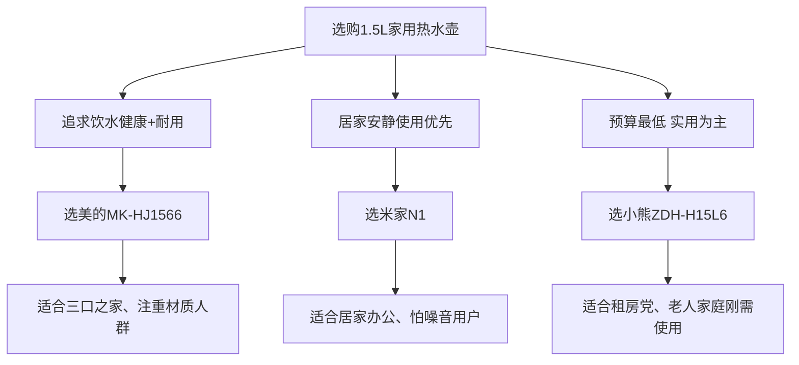

+++
title = "2026家用1.5L优质电热水壶精选推荐 百元内耐用安全烧水水壶测评"
summary = "精选3款1.5L家用热水壶，美的全能实用，米家静音舒适，小熊性价比最高，适配多数家庭日常饮水需求。"
date = "2026-05-16"
tags = ["1.5L电热水壶","家用热水壶","304不锈钢烧水壶","百元内电水壶","居家烧水电器"]
+++

## 🏆 30-Second Verdict (TL;DR)
- **Best Overall Choice**: [美的MK-HJ1566 电热水壶](https://union-click.jd.com/jdc?e=618%7Cpc%7C&p=JF8BATUJK1olWAcFV19aC0sSBV8IGloUVAYBUlxfDE8nRzBQRQQlBENHFRxWFlVPRjtUBABAQlRcCEBdCUoWCm8LHVkXWQIdDRsBVXtqcCpxcycTImZyKgMLdEJKCyRaTjNlUQoyVW5eCUsfAm0KHlkdbTYCU24PZhlORyZQSwVHHEQGZF9tCE0RCmYAH10WXwcCU25aCEInWDpmHAsUWVNXVFcNDxgeBl84K1glWgYLQFgvSRkDBR04K1slXjYCVV5cCk4SBG8PH0cVWgIAVVpBCE0RCmYAH14dWgIEUW5fCUoTCl84xdalOwVhCTgtQzcfZW5RXSNjItiP5E8hbE8XAmoZKxNdCHNpUR9VSS5vfh9-HwNIHH4BMScnAEhpbW1ofQ5gNgNDXB8VcEpEYi58cmsQbQAAUm4) - 全钢水路更健康，无缝内胆易清洁，居家通用适配性强。
- **Best Quiet Use**: [米家N1电热水壶](https://union-click.jd.com/jdc?e=618%7Cpc%7C&p=JF8BATUJK1olWAcFV19aC0sSBV8IGloUWgIDUFdZDUgnRzBQRQQlBENHFRxWFlVPRjtUBABAQlRcCEBdCUoWBGsJH1IRWAUdDRsBVXt2ZHVPQQNvO2YEFFwcTDhEUDNIRh9DUQoyVW5eCUsfAm0KHlkdbTYCU24PZhlORyZQSwVHHEQGZF9tCE0RCmYAH10cXQAEXG5aCEInWDpmHAsUWVNXVFcNDxgeBl84K1glWgYLQFgvSRkDBR04K1slXjYCVV5cCk4SBG8PH0cVWgIAVVpBCE0RCmYAH14dWgIEUW5fCUoTCl84xdalIwJJKQNeDhhTfWt6eFtpWtiP5E8veEsVC20ZKxlXBAZiJwRUSypgZTxhTDoUWXFbDiZYUylsbW1sYwIVPXVYXR0ffxQeQRlWT2sQbQAAUm4) - 低噪烧水不扰民，节能省电，适配极简家装与小米生态。
- **Best Budget Pick**: [小熊ZDH-H15L6电热水壶](https://union-click.jd.com/jdc?e=618%7Cpc%7C&p=JF8BAUkJK1olWAcFV19aC0sSBV8IGloUWw8BVFldC0knRzBQRQQlBENHFRxWFlVPRjtUBABAQlRcCEBdCUoWBWYLG1wVXgQdDRsBVUVTXDdWRCdBCF5SMQ4LBEh5AgEIKyxtHkNANzUrahNTBA5LBT5LG2ELFghRBHsWM2wJG1MUXwQHVlZtOEsQMz1mSQJRFF5SCgwcSk8nAl8IHV0cVA4GXV1cDUISM2gIEmtOCGgFBF9ZXR4XCj8PSFIQbTYyV25aCEIDBR1JSU8TLzYyVG5eOEsWA24KHl4SXQEGSF5aDEkWB3MIHV0cVA4GUVZaDE0SM20JGl8cbTbc2e4-fU9UdWlbHyIVIFB7Ax0I1sanEhNsH1sUWBcyCwEmdg51AR93cgNxVUcFBik1UAt3Yz1sUzN7X3RlLyAYaklnfDBQWC4RGEdSZFttDkkRMw) - 百元内低价实用，防烫防烫伤设计，老人小孩均可轻松操作。

## 📊 Core Specs Comparison
| 产品名称 | 售价区间 | 额定功率 | 内胆材质 | 核心特色 | 整机重量 |
| ---- | ---- | ---- | ---- | ---- | ---- |
| 美的MK-HJ1566 | **69-79元** | **1500W** | 304不锈钢无缝内胆 | 全钢水路、三重安全防护 | 1.2kg |
| 米家N1 | **69元** | **1500W** | 304不锈钢内胆 | 静音烧水、低待机功耗 | 1.1kg |
| 小熊ZDH-H15L6 | **59-69元** | **1500W** | 304不锈钢无缝内胆 | 阻尼缓开盖、360°旋转底座 | 1.1kg |

## 🧠 Decision Guide

## 🔍 Deep Dive

### 美的 MK-HJ1566 电热水壶：健康耐用之选

该机型采用**全钢无塑水路设计**，烧水过程无塑料接触，满足高健康饮水需求。1500W大功率实现快速烧水，1.5L容量适配日常全家饮水、泡茶冲饮场景。三重安全防护机制可有效规避干烧、过热风险，日常使用稳定性高。

**优点**：
- ✅ 无缝内胆不易积攒水垢，清洁难度低
- ✅ 双层防烫机身，握持使用更安全
- ✅ 外观简约百搭，适配多数家居装修风格

**缺点**：
- ❌ 无恒温保温功能
- ❌ 价格高于基础入门款电水壶

[👉 Check Latest Price](https://union-click.jd.com/jdc?e=618%7Cpc%7C&p=JF8BATUJK1olWAcFV19aC0sSBV8IGloUVAYBUlxfDE8nRzBQRQQlBENHFRxWFlVPRjtUBABAQlRcCEBdCUoWCm8LHVkXWQIdDRsBVXtqcCpxcycTImZyKgMLdEJKCyRaTjNlUQoyVW5eCUsfAm0KHlkdbTYCU24PZhlORyZQSwVHHEQGZF9tCE0RCmYAH10WXwcCU25aCEInWDpmHAsUWVNXVFcNDxgeBl84K1glWgYLQFgvSRkDBR04K1slXjYCVV5cCk4SBG8PH0cVWgIAVVpBCE0RCmYAH14dWgIEUW5fCUoTCl84xdalOwVhCTgtQzcfZW5RXSNjItiP5E8hbE8XAmoZKxNdCHNpUR9VSS5vfh9-HwNIHH4BMScnAEhpbW1ofQ5gNgNDXB8VcEpEYi58cmsQbQAAUm4)

### 米家N1电热水壶：静音节能之选

主打**低噪烧水核心优势**，运行过程噪音控制优异，深夜、清晨烧水不会打扰家人休息。整机功耗控制合理，长期使用更加省电，纯白机身可与小米全系智能家电风格统一，适配极简居家布局。导流壶嘴设计可减少倒水洒水情况，日常使用体验流畅。

**优点**：
- ✅ 待机功耗低，节能环保
- ✅ 机身轻便，挪动摆放灵活
- ✅ 颜值统一，适配智能家居布局

**缺点**：
- ❌ 仅提供白色单一配色
- ❌ 不支持恒温保温功能

[👉 Check Latest Price](https://union-click.jd.com/jdc?e=618%7Cpc%7C&p=JF8BATUJK1olWAcFV19aC0sSBV8IGloUWgIDUFdZDUgnRzBQRQQlBENHFRxWFlVPRjtUBABAQlRcCEBdCUoWBGsJH1IRWAUdDRsBVXt2ZHVPQQNvO2YEFFwcTDhEUDNIRh9DUQoyVW5eCUsfAm0KHlkdbTYCU24PZhlORyZQSwVHHEQGZF9tCE0RCmYAH10cXQAEXG5aCEInWDpmHAsUWVNXVFcNDxgeBl84K1glWgYLQFgvSRkDBR04K1slXjYCVV5cCk4SBG8PH0cVWgIAVVpBCE0RCmYAH14dWgIEUW5fCUoTCl84xdalIwJJKQNeDhhTfWt6eFtpWtiP5E8veEsVC20ZKxlXBAZiJwRUSypgZTxhTDoUWXFbDiZYUylsbW1sYwIVPXVYXR0ffxQeQRlWT2sQbQAAUm4)

### 小熊ZDH-H15L6电热水壶：高性价比之选

定位入门刚需家用款，定价亲民，是百元内高性价比选择。配备阻尼缓开壶盖，可缓冲沸水热气喷出，降低烫伤概率，对家中老人、孩童十分友好。360°旋转底座不受摆放角度限制，取水使用便捷，操作逻辑简单无学习成本。

**优点**：
- ✅ 同容量款式中价格最低
- ✅ 机身轻量化，收纳摆放不占空间
- ✅ 基础安全防护齐全，日常使用稳妥

**缺点**：
- ❌ 功能偏向基础，无额外特色配置
- ❌ 缺失恒温保温实用功能

[👉 Check Latest Price](https://union-click.jd.com/jdc?e=618%7Cpc%7C&p=JF8BAUkJK1olWAcFV19aC0sSBV8IGloUWw8BVFldC0knRzBQRQQlBENHFRxWFlVPRjtUBABAQlRcCEBdCUoWBWYLG1wVXgQdDRsBVUVTXDdWRCdBCF5SMQ4LBEh5AgEIKyxtHkNANzUrahNTBA5LBT5LG2ELFghRBHsWM2wJG1MUXwQHVlZtOEsQMz1mSQJRFF5SCgwcSk8nAl8IHV0cVA4GXV1cDUISM2gIEmtOCGgFBF9ZXR4XCj8PSFIQbTYyV25aCEIDBR1JSU8TLzYyVG5eOEsWA24KHl4SXQEGSF5aDEkWB3MIHV0cVA4GUVZaDE0SM20JGl8cbTbc2e4-fU9UdWlbHyIVIFB7Ax0I1sanEhNsH1sUWBcyCwEmdg51AR93cgNxVUcFBik1UAt3Yz1sUzN7X3RlLyAYaklnfDBQWC4RGEdSZFttDkkRMw)

## 🙋‍♂️ FAQ

### 1. 1.5L容量电热水壶适合几口人家庭使用？
1.5L标准容量单次可满足2-4人日常饮水需求，适配小户型、三口之家日常泡茶、冲咖啡、饮用白开水等基础用水场景，日常家用尺寸适中不占地。

### 2. 没有恒温保温功能的电热水壶值得入手吗？
日常仅需烧开即饮、即时冲泡饮品的用户，无恒温功能完全够用，还能降低产品售价与机身功耗；有长时间存热水需求，可额外搭配保温容器使用。

### 3. 304不锈钢内胆烧开水会产生异味吗？
正规食品级304不锈钢内胆本身无异味，其中无缝全钢水路款式彻底隔绝塑料接触，新机简单沸水清洗1-2次后，即可做到烧水无异味，饮水安全性更高。

## ✅ Final Recommendations

| 使用场景 | 推荐型号 | 推荐理由 |
| ---- | ---- | ---- |
| 三口之家日常使用 | 美的MK-HJ1566 | 全钢水路更健康，耐用性强 |
| 居家办公/熬夜党 | 米家N1 | 静音不扰民，极简颜值高 |
| 租房/学生/备用 | 小熊ZDH-H15L6 | 价格最低，防烫设计更安全 |
| 小米智能家居用户 | 米家N1 | 生态适配，风格统一 |

**购买提示**：三款产品目前均支持京东618价保服务，建议在大促期间入手，价格通常会有10-20元的优惠空间。建议搭配凑单商品使用满减券，可以做到更低的入手价格。